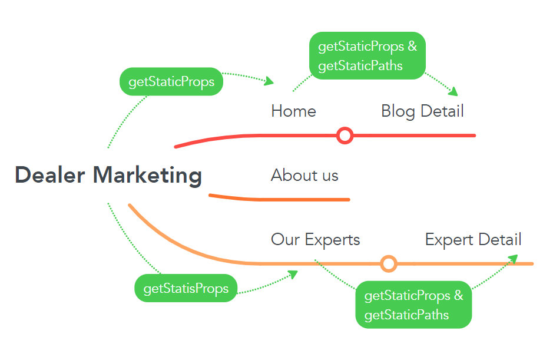

# OVERVIEW

- This document provides a detailed estimate of the Next.JS Practice. This practice creates a Dealer-Marketing app with goals that I can apply Next.js knowledge.

## FEATURES

- User can see blogs list
- User can see experts list
- User can search blog by title
- User can see blog details
- User can see expert details

## DESIGN

- [UI](https://www.dealermarketing.com/)

## TIMELINE

- Estimated time: (29/7/2022 - 5/8/2022) [5 working days](https://docs.google.com/document/d/1Z6lftn0NQNdCeZ4BgTOoaTBS9kBSNZv_awwHmY10o0U/edit#heading=h.b81umtm0t9oh)

## TEAM SIZE

- 1 dev

## TECHNICAL STACK

- NextJs
- React
- CSS Modules
- Vercel

## EDITOR

- Visual Studio Code

## DEVELOP TOOLS

- Typescript
- husky, prettier, eslint

# PREREQUISITES

- Install pnpm **(Node.js is preinstalled)**

  ```
   On Linux or macOS:
    curl -f https://get.pnpm.io/v6.16.js | node - add --global pnpm
  ```

  ```
  On Windows (PowerShell):
   Invoke-WebRequest 'https://get.pnpm.io/v6.16.js' -UseBasicParsing -o pnpm.js; node pnpm.js add --global pnpm; Remove-Item pnpm.js
  ```

  ```
  Using npm:
  npm install -g pnpm
  ```

# INFORMATION .env.local file

```
NEXT_PUBLIC_BASE_URL="http://localhost:3000/api"
```

# WORKFLOW



# DEPLOYMENT

```
https://dealer-marketing-ht.vercel.app/
```

# RUN

```
- Clone project:
- git clone git@gitlab.asoft-python.com:thuong.buihoai/react-training.git
- cd react-training
- git checkout feature/nextjs-practice
- cd dealer-marketing
- Install dependencies : pnpm install
- Run app: pnpm dev
- Open on web: http://localhost:3000/
```
